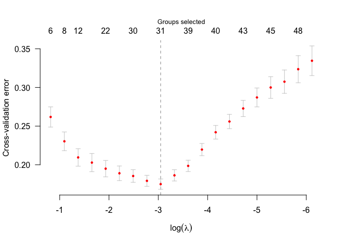
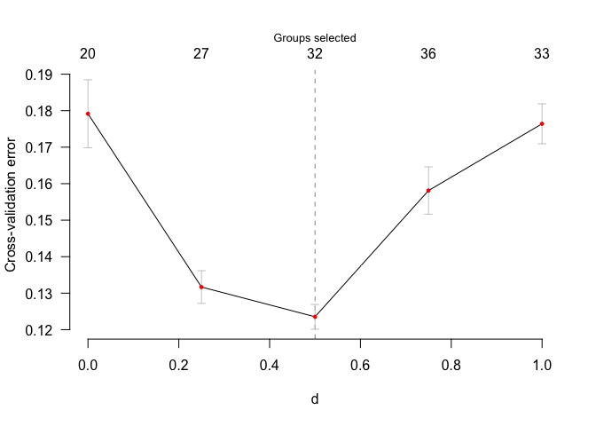

<!-- README.md is generated from README.Rmd. Please edit that file -->

# sglasso

<!-- badges: start -->


[](https://lifecycle.r-lib.org/articles/stages.html#experimental)
<!-- badges: end -->

This package provides functions for computing a group-wise variable
selection method, called Scaled Group Lasso (SGLASSO), in the presence
of correlations among groups.

## Installation

You can install the development version of sglasso like so:

``` r
# install from GitHub
install.packages("devtools") # if you have not installed "devtools" package
devtools::install_github("byuzbasi/sglasso")
```

If you get a error about gfortran, you can visit the page to fix in
[gfortran installation guide](.\help\gfortran_installation_guide.html).

## Example

This is a basic example which shows you how to solve a common problem:

``` r
library(sglasso)
#> Loading required package: Matrix
data(GenAtHum,package = "sglasso")
X <- GenAtHum$X
y <- GenAtHum$y
group <- GenAtHum$group
n =  nrow(X)
p =  ncol(X)
set.seed(2025)
model_CV <- cv.sglasso(X,y,group, nlambda=20, nd= 5, nfold = 5, alpha = 0.4)
plot(model_CV)
```



``` r
plot(model_CV,type.tun = "d")
```



# References

1.  Yüzbaşı, B and Cao, J. (2025). Collinear Groupwise Selection via
    Scaled Group Lasso.
