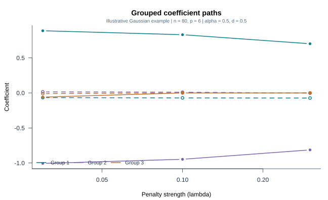

<!-- README.md is generated from README.Rmd. Please edit that file. -->

# sglasso


<p align="center">


</p>

<p align="center">

<a href="#installation">Install</a> · <a href="#quick-start">Quick
start</a> · <a href="#binary-responses">Binary responses</a> ·
<a href="#research-code">Research code</a> ·
<a href="#citation">Cite</a>
</p>

**Regression with meaningful predictor groups and correlated
covariates.** `sglasso` combines group sparsity with target-directed
quadratic shrinkage. Fit regularization paths, choose tuning parameters
by cross-validation, and predict continuous outcomes or binary-event
probabilities.

| Group structure | Two response families | Compiled numerical core |
|:---|:---|:---|
| User-defined, nonoverlapping predictor groups | Gaussian regression and binomial probability prediction | RcppArmadillo routines with documented numerical checks |

## Installation

``` r
install.packages("remotes") # only if needed
remotes::install_github("byuzbasi/sglasso")
library(sglasso)
packageVersion("sglasso")
```

**GitHub development version.** This documentation describes the 1.2.0
source, including the binomial interface. Binary examples require 1.2.0
or later. This is not a tagged or CRAN release; the badges do not claim
passing remote CI.

Source installation requires an R/C++ toolchain. See the existing
[gfortran installation
guide](https://byuzbasi.github.io/sglasso/help/gfortran_installation_guide.html)
if your compiler setup needs attention.

## Quick start

A small Gaussian example with three prespecified groups:

``` r
library(sglasso)
set.seed(19)
x <- matrix(rnorm(80 * 6), 80, 6)
group <- rep(1:3, each = 2)
y <- x[, 1] - x[, 3] + rnorm(80)
fit <- sglasso(x, y, group, family = "gaussian",
               lambda = c(0.3, 0.1, 0.03), d = c(0, 0.5),
               alpha = 0.5, screen = "none")
coef(fit, lambda = 0.1, d = 0.5)
predict(fit, newx = x[1:3, ], lambda = 0.1, d = 0.5)
```



*Illustrative quick-start paths, not a benchmark or research-study
evidence. [Reproduction code](tools/render_sglasso_gallery.R).*

The group vector has one entry per predictor. It describes your
scientific design; the package does not discover biological or spatial
groups. Use genuinely held-out observations to assess generalization.

## Binary responses

Logistic SGLASSO accepts outcomes coded as zero and one and predicts
probabilities for the outcome coded as one.

``` r
stopifnot(packageVersion("sglasso") >= "1.2.0")
set.seed(19)
x <- matrix(rnorm(240), 60, 4)
y <- rbinom(60, 1, plogis(x[, 1]))
fit <- sglasso(x, y, c(1, 1, 2, 2), family = "binomial",
               lambda = c(0.3, 0.1), d = c(0, 0.5))
predict(fit, newx = x[1:3, ], lambda = 0.1, d = 0.5,
        type = "response")
```

| Control | Role |
|:---|:---|
| `group` | Prespecified predictor-group membership |
| `alpha` | Mixes group sparsity and quadratic shrinkage; fixed within each CV call |
| `d` | Scales the training-derived target, between zero and one |
| `lambda` | Overall penalty strength over a finite search path |

For the binomial objective, `d = 0` gives zero-target group elastic net.
Positive `d` pulls toward training-only groupwise Firth estimates when
the quadratic component is present; at `alpha = 1`, `d` has no effect.
Positive targets are not claimed to improve every dataset, and
prediction-optimal tuning need not recover the true group support.

Binomial `cv.sglasso()` recomputes preprocessing and Firth targets
inside each training fold and selects by out-of-fold log-loss.
Classification requires a separately declared probability threshold. See
[the binomial and CV guide](vignettes/articles/binomial-and-cv.Rmd) and
`help("sglasso-binomial")`.

<details>

<summary>

<strong>Numerical scope and safeguards</strong>
</summary>

The binomial solver uses IRLS/proximal-Newton updates, profiled block
updates and a monotone APG fallback. All requested finite path points
must pass numerical checks. A failed required Firth target is not
replaced by MLE or ridge. Missing or nonnumeric predictors are rejected,
not imputed.

Automatic lambda paths are relative, fold-local grids. A supplied lambda
vector fixes an absolute grid. Endpoint selections warn that performance
beyond the grid is unassessed; a universal null-model maximum is not
claimed for positive targets. No solver can promise convergence for
every possible input.

Gaussian screening options are `"SSR"`, `"none"` and experimental
`"SSR_fast"`; these are not interchangeable with binomial active-set
controls. Consult the reference before changing tolerances or stopping
criteria.

</details>

## Research code

The package API and article-specific reproduction code serve different
purposes. The five displayed logistic-study methods are SGLASSO, Group
ENET, Group Lasso, Group MCP and Group SCAD. Only SGLASSO is implemented
by this package; the run code invokes the comparator packages and
retains the additional `d = 0` audit variant.

| Study | Status and code |
|:---|:---|
| **Collinear Groupwise Selection via Scaled Group Lasso** — Yüzbaşı and Cao (2026), *The American Statistician*, 1–23; advance online publication, 17 September 2026 | [Published article](https://doi.org/10.1080/00031305.2026.2709494) · [`paper_codes/`](paper_codes/) |
| **Logistic SGLASSO: Prediction with Correlated Predictor Groups** — Yüzbaşı | Manuscript in preparation · [`logistic_paper_codes/`](logistic_paper_codes/README.txt) |

The logistic directory contains run scripts, required numerical sources
and configurations **only**, not measurements, models, manuscript PDFs
or result archives. Study calculations use their recorded research
implementations, not retrospective substitution of the package API.

[Reproduction guide](vignettes/articles/reproducibility.Rmd) · [Example
gallery](vignettes/articles/gallery.Rmd)

## Data

**GenAtHum:** Gene Atlas Human example with 158 observations, 2,045
predictors and 79 groups. Use `data(GenAtHum, package = "sglasso")`.

**CoRSIVSZ:** a processed blood-methylation panel for schizophrenia
classification with 847 development participants, 675 independent-test
participants, 1,107 CpGs and 409 annotation-defined groups. Its exact
versioned file is distributed separately; `data(CoRSIVSZ)` is not
supported.

``` r
# After obtaining the exact separately distributed file:
CoRSIVSZ <- load_CoRSIVSZ("CoRSIVSZ_v1.rds")
dim(CoRSIVSZ$development$X)
dim(CoRSIVSZ$external$X)
```

The release asset is prepared locally; no public download endpoint is
claimed. Original measurements:
[GSE84727](https://www.ncbi.nlm.nih.gov/geo/query/acc.cgi?acc=GSE84727)
and
[GSE80417](https://www.ncbi.nlm.nih.gov/geo/query/acc.cgi?acc=GSE80417).
`load_CoRSIVSZ()` and explicit `download_CoRSIVSZ(url, destfile)` calls
verify the exact size and SHA-256 without fitting or changing
measurements. [Data dictionary and source
terms](vignettes/articles/data-dictionary.Rmd).

## Citation

Yüzbaşı, B. and Cao, J. (2026). **Collinear Groupwise Selection via
Scaled Group Lasso.** *The American Statistician*, 1–23. Advance online
publication, 17 September 2026.
[doi:10.1080/00031305.2026.2709494](https://doi.org/10.1080/00031305.2026.2709494).

Use `citation("sglasso")` for the R citation and
[CITATION.cff](CITATION.cff) for software/article metadata. The logistic
manuscript has no published DOI. The GitHub development source is
distinct from a tagged or CRAN release.

## Support and validation

[Development notes](NEWS.md) · [GitHub
issues](https://github.com/byuzbasi/sglasso/issues)

Report problems with a small synthetic example, package version and
relevant diagnostics. Do not upload private data, credentials or
identifying local paths. Small documentation checks do not imply passing
remote CI or numerical validation on every operating system.
[Documentation website](https://byuzbasi.github.io/sglasso/).
