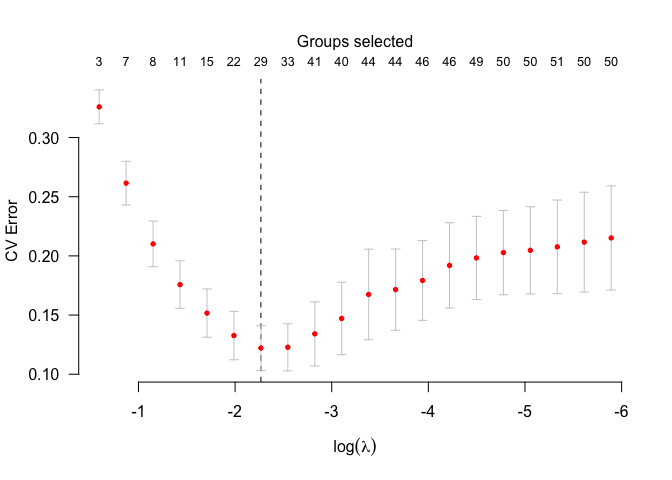
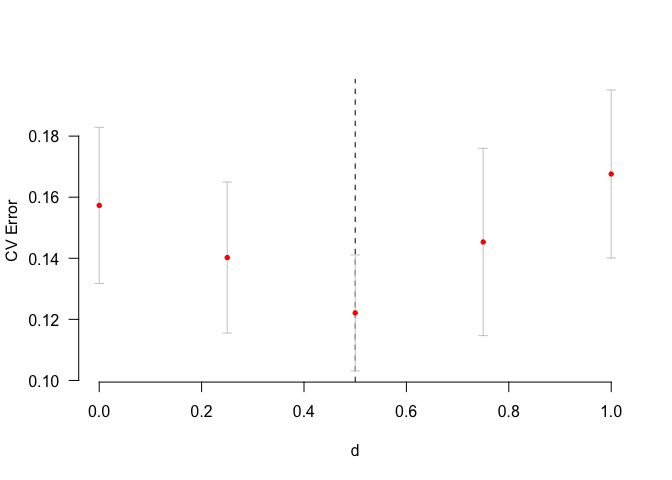

<!-- README.md is generated from README.Rmd. Please edit that file -->

# sglasso

<!-- badges: start -->


[](https://lifecycle.r-lib.org/articles/stages.html#experimental)
<!-- badges: end -->

This package provides functions for computing a group-wise variable
selection method, called Scaled Group Lasso (SGLASSO), in the presence
of correlations among groups. The package accompanies the article
[“Collinear Groupwise Selection via Scaled Group Lasso”](https://doi.org/10.1080/00031305.2026.2709494),
published in *The American Statistician*.

## Installation

You can install the development version of sglasso like so:

``` r
# install from GitHub
install.packages("devtools") # if you have not installed "devtools" package
devtools::install_github("byuzbasi/sglasso")
```

If you see a gfortran-related error, refer to the [gfortran installation
guide](https://byuzbasi.github.io/sglasso/help/gfortran_installation_guide.html)
to fix it.

## Binary responses

The development interface supports `family = "binomial"` with numeric 0/1
responses. It uses the accelerated RcppArmadillo IRLS/proximal-Newton core,
profiled block updates and APG fallback. The Gaussian solver is unchanged.

``` r
set.seed(19)
x <- matrix(rnorm(240), 60, 4)
y <- rbinom(60, 1, plogis(x[, 1]))
fit <- sglasso(x, y, c(1, 1, 2, 2), family = "binomial",
               lambda = c(0.3, 0.1), d = c(0, 0.5))
predict(fit, x[1:3, , drop = FALSE], type = "response")
```

For binomial `cv.sglasso()`, preprocessing and Firth targets are fitted within
each training fold; selection minimizes out-of-fold log-loss. Set a seed or
supply identical folds for reproducibility. Alpha is fixed in each call.
Automatic lambda paths are fold-local relative grids; supplying lambda fixes
an absolute grid. An endpoint selection warns that the optimum beyond the
finite grid is unassessed. No universal null-model lambda maximum is claimed
for positive targets.

See `help("sglasso-binomial")` for the objective, controls, convergence checks,
preprocessing and unsupported options. These are numerical safeguards, not a
guarantee of convergence on every possible dataset. Frozen research results
were obtained with their recorded research implementations, not retrospectively
with this package version.

## Gaussian screening rules

`sglasso()` includes optional screening rules through the `screen` argument:
`"SSR"`, `"SSR_fast"`, and `"none"`. The SSR rule accounts for the shifted
ridge component in the SGLASSO penalty. Screening rules are most useful for
large-scale problems with many inactive groups. For small or moderate problems,
`screen = "none"` may be equally fast or faster because it avoids screening
overhead while the final KKT checks still enforce the fitted solution. The
`SSR_fast` option is experimental and delays rest-set KKT checks to study the
speed-accuracy trade-off.

## Example

This is a basic example which shows you how to solve a common problem:

``` r
library(sglasso)
#> Loading required package: Matrix
data(GenAtHum,package = "sglasso")
X <- GenAtHum$X
y <- GenAtHum$y
group <- GenAtHum$group
n =  nrow(X)
p =  ncol(X)
set.seed(2025)
model_CV <- cv.sglasso(X,y,group, nlambda=20, nd= 5, nfold = 5, alpha = 0.4)
plot(model_CV)
```



``` r
plot(model_CV,type.tun = "d")
```



# References

1.  Yüzbaşı, B. and Cao, J. (2026). Collinear Groupwise Selection via
    Scaled Group Lasso. *The American Statistician*.
    https://doi.org/10.1080/00031305.2026.2709494
