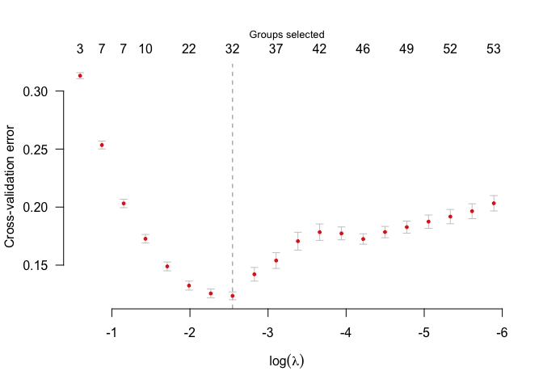

<!-- README.md is generated from README.Rmd. Please edit that file -->

# sglasso

<!-- badges: start -->
<!-- badges: end -->

The goal of sglasso is to …

## Installation

You can install the development version of sglasso like so:

``` r
# install from GitHub
devtools::install_github("byuzbasi/sglasso")
```

## Example

This is a basic example which shows you how to solve a common problem:

``` r
library(sglasso)
#> Loading required package: Matrix
data(GenAtHum,package = "sglasso")
X <- GenAtHum$X
y <- GenAtHum$y
group <- GenAtHum$group
n =  nrow(X)
p =  ncol(X)
set.seed(123)
model_CV <- cv.sglasso(X,y,group, nlambda=20, nd=3, nfolds =5)
plot(model_CV)
```


